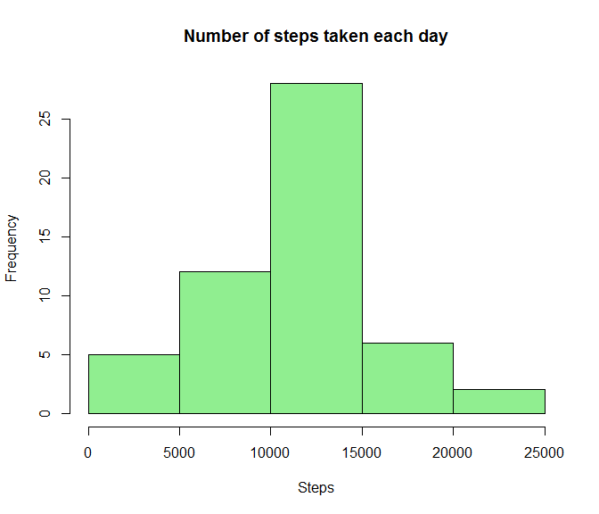
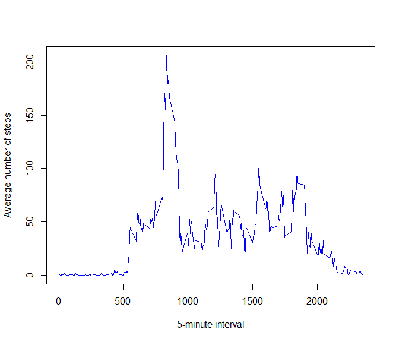
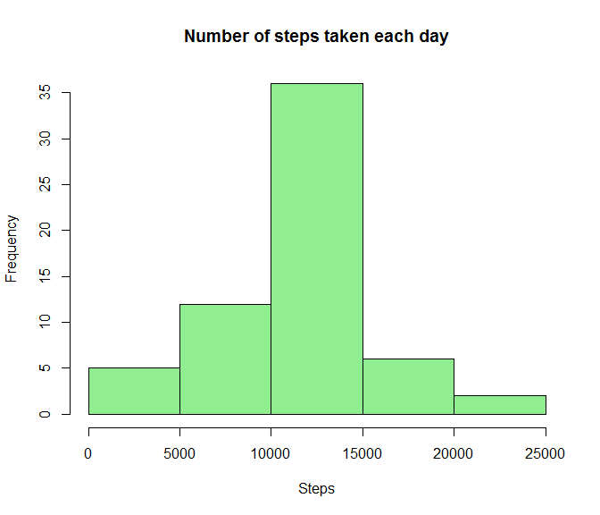
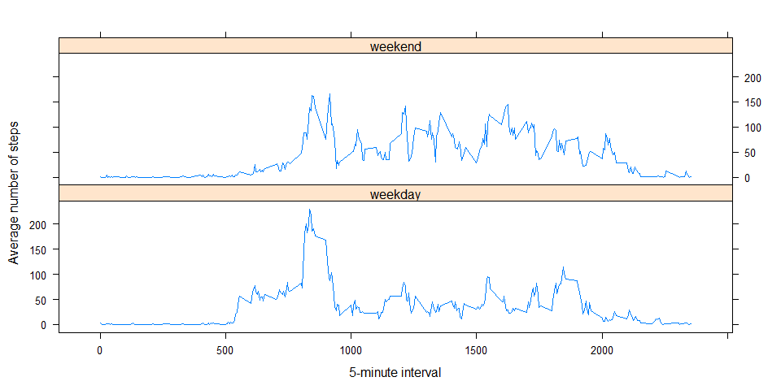

# Reproducible Research: Peer Assessment 1


## Loading and preprocessing the data

```r
        actDT <- read.csv("activity.csv", header=TRUE, sep=",")
        ## Tansform date variable as a Date
        actDT$date <- as.Date(actDT$date , "%Y-%m-%d")
```

## What is mean total number of steps taken per day?

```r
        ## Cleanup NA's values
        actDT2 <- na.omit(actDT)     
```

Histogram of the total number of steps taken each day


```r
        ## Summarize the data
        dths = aggregate(actDT2$steps, actDT2['date'], sum)
        
        hist(   dths$x, 
                xlab="Steps", 
                main="Number of steps taken each day", 
                col="lightgreen")
```

 

Mean of the total number of steps taken per day

```r
        mean(dths$x)
```

```
## [1] 10766.19
```

Median of the total number of steps taken per day

```r
        median(sort(dths$x, decreasing = FALSE))
```

```
## [1] 10765
```

## What is the average daily activity pattern?

```r
        ## Collapse the data
        df <- aggregate(steps ~ interval, actDT2, mean)
```
Time series plot of the 5-minute interval and the average number of steps taken.


```r
        plot(df$interval,
             df$steps,
             type="l", 
             xlab= "5-minute interval", 
             ylab = "Average number of steps",
             col="blue")
```

 

5-minute interval with the maximum number of steps.

```r
        df[which.max(df$steps),]        
```

```
##     interval    steps
## 104      835 206.1698
```
## Imputing missing values
Total number of missing values in the dataset.

```r
        sum(is.na(actDT$steps))
```

```
## [1] 2304
```
Fill in all of the missing values in the dataset with the mean for that 5-minute interval

```r
        ## Replace line by line if NA is found with the equivalent steps mean 
        ## from the "df" dataset, which cointains all means for each interval.
        for (i in 1:nrow(actDT)) {
                if(is.na(actDT[i,]$steps)){
                        ## Get the interval of the NA.
                        intvl <- actDT[i,]$interval
                        ## Replace the NA.
        	        actDT[i,]$steps <- df[(df$interval == intvl),]$steps
                }
        }
        
        ## Look for NA's if any in the new dataset "actDT" 
        sum(is.na(actDT$steps))
```

```
## [1] 0
```

Make a histogram of the total number of steps taken each day and Calculate and report the mean and median total number of steps taken per day


```r
        ## Summarize the data
        dths2 = aggregate(actDT$steps, actDT['date'], sum)
        
        hist(   dths2$x, 
                xlab="Steps", 
                main="Number of steps taken each day", 
                col="lightgreen")
```

 

Mean of the total number of steps taken per day

```r
        mean(dths2$x)
```

```
## [1] 10766.19
```

Median of the total number of steps taken per day

```r
        median(sort(dths2$x, decreasing = FALSE))
```

```
## [1] 10766.19
```
## Are there differences in activity patterns between weekdays and weekends?

Create a new factor variable in the dataset with two levels - "weekday" and "weekend"

```r
        ##Add the new variable.
        actDT$dayweek <- ifelse(weekdays(actDT$date) == "sábado" | weekdays(actDT$date) == "domingo", 
                                "weekend", "weekday" ) 
        
        ## The new variable is there.
        head(actDT)
```

```
##       steps       date interval dayweek
## 1 1.7169811 2012-10-01        0 weekday
## 2 0.3396226 2012-10-01        5 weekday
## 3 0.1320755 2012-10-01       10 weekday
## 4 0.1509434 2012-10-01       15 weekday
## 5 0.0754717 2012-10-01       20 weekday
## 6 2.0943396 2012-10-01       25 weekday
```

Make a panel plot containing a time series plot of the 5-minute interval and the average number of steps taken, averaged across all weekday days or weekend days

```r
        ## Collapse the data
        dtw <- aggregate(actDT$steps,list(interval=actDT$interval, dayweek=actDT$dayweek), mean)
```


```r
        ##Load the Lattice library
        library(lattice)
        
        ## Make the plot
        xyplot(x~interval|dayweek, 
               dtw,  
               type = "l", 
               xlab= "5-minute interval",
               ylab = "Average number of steps",
               layout = c(1,2))
```

 

There is a slight difference between weekdays and weekends.
